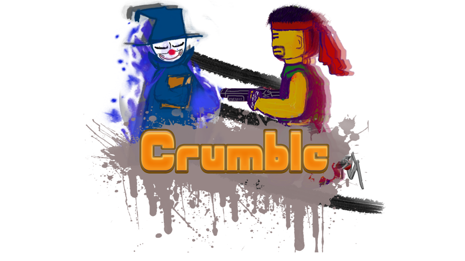
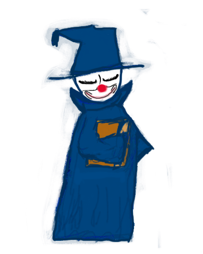
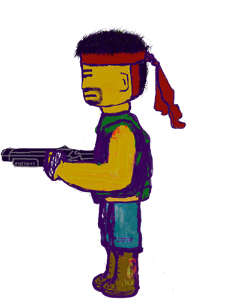

# Fall Of Bastille

A two-player fighting game based on the JavaFX framework, currently featuring two characters: a spell wizard and a shotgun-wielding mechanic!

-----------------------------------------------------------------------------------------

Run the "Launcher.Java" start the game play

-----------------------------------------------------------------------------------------
# Character:

## Mage：100HP

**A W D** Movement

**G**：Inferno Blast; releases a fireball directly in front of you, the longer you chant the more damage you do and the bigger the fireball gets (max spike, min 25 pts), movement speed halved while chanting, 2s Cool Down

## Mechan：100HP

**← ↑ →** Movement

**SPACE**: Shoot!

All character have double jump!

## Hint: If you find that your character moves slowly (like slow motion), #**_play on a better computer_**!